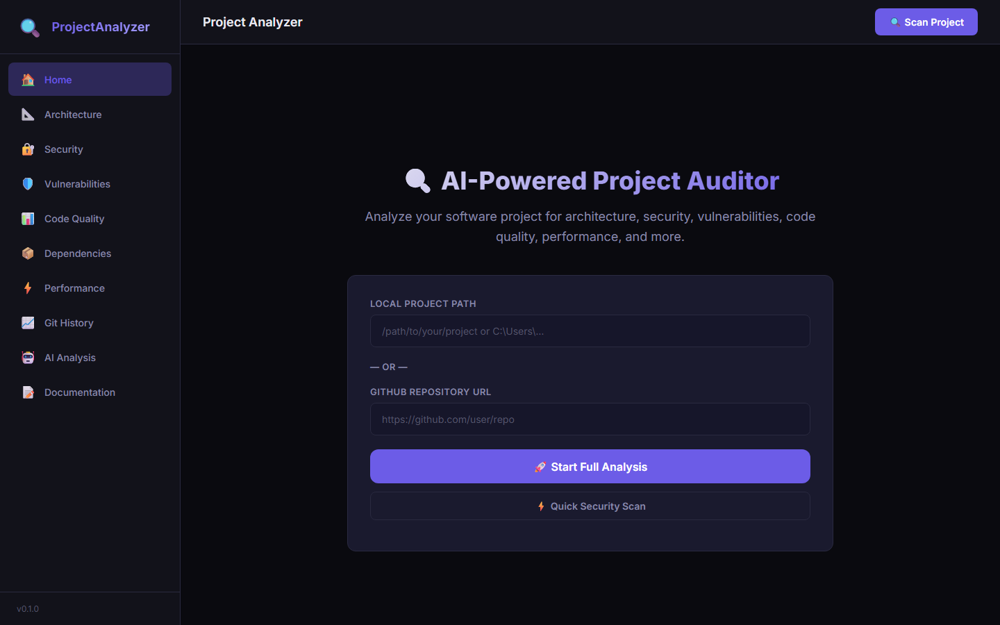

# 🔍 Project Analyzer — AI-Powered Software Auditor

> **Scan any codebase in seconds.** Get a complete audit of architecture, security, vulnerabilities, code quality, dependencies, performance — with an AI-powered executive summary and prioritized action items.

[](https://github.com/Fernandezalejo1/project-analyzer/actions/workflows/ci.yml)
[](https://opensource.org/licenses/MIT)
[](https://www.python.org/downloads/)
[](https://fastapi.tiangolo.com/)
[](https://github.com/Fernandezalejo1/project-analyzer/tree/master/backend/tests)
[](https://docs.docker.com/compose/)

---

## 📸 Screenshots

> 🚀 **Try it live:** Run `docker compose up -d --build` and open [http://localhost:8080](http://localhost:8080)


*Home screen with project path input and scan buttons*


---

## ✨ Features

| Module | What it does |
|--------|-------------|
| 📐 **Architecture** | Detects languages, frameworks, project type; generates architecture map |
| 📦 **Dependencies** | Scans `package.json`, `requirements.txt`, `Cargo.toml`, `pom.xml`, `go.mod`, and more |
| 🔐 **Security** | Detects leaked secrets, API keys, credentials, `.env` files, certificates |
| 🛡️ **Vulnerabilities** | SQL Injection, XSS, CSRF, Command Injection, Path Traversal, SSRF |
| 📊 **Code Quality** | Cyclomatic complexity, duplication, dead code, maintainability, technical debt |
| 📈 **Git History** | Large commits, secrets in history, abandoned branches, contributor stats |
| ⚡ **Performance** | N+1 queries, blocking I/O, expensive loops, memory issues, heavy files |
| 🤖 **AI Analysis** | Architecture recommendations, scalability concerns, priority actions |
| 📝 **Documentation** | Auto-generates README, architecture diagrams (Mermaid), onboarding guide |
| 📋 **Executive Report** | 0-100 score with category breakdown and prioritized action items |

---

## 🚀 Quick Start

### Prerequisites

- **Python 3.11+**
- **Git** (for git history analysis and cloning repos)

### Option 1: Run Locally

```bash
# Clone the repo
git clone https://github.com/Fernandezalejo1/project-analyzer.git
cd project-analyzer

# Backend
cd backend
pip install -r requirements.txt
```

**CLI usage** — analyze any project:
```bash
# Local project
python -m app.main /path/to/your/project

# GitHub repo (clones automatically)
python -m app.main https://github.com/user/repo

# Generates two reports:
#   analysis-report.json  (full structured data)
#   analysis-report.md    (human-readable markdown)
```

**API server** — for the web dashboard:
```bash
python -m app.main serve
# API runs at http://localhost:8000
# Swagger docs at http://localhost:8000/docs
```

**Frontend** — open directly or serve:
```bash
cd ../frontend
# Simply open index.html in your browser
# Or serve it:
python -m http.server 5173
# Open http://localhost:5173
```

### Option 2: Docker

```bash
docker compose up -d --build
# Frontend: http://localhost:8080
# API:      http://localhost:8000
# Swagger:  http://localhost:8000/docs

# Analizar un repo que está en tu máquina (montado como volumen de solo lectura)
docker compose run --rm -v "/ruta/a/mi-proyecto:/scan:ro" api python -m app.main /scan
```

---

## 🧪 Testing

28 tests cubren los analyzers con proyectos de ejemplo armados en directorios
temporales: secretos filtrados, SQL por f-string, `eval(input())`, `os.system`,
criptografía débil, imports sin usar y directorios sin repo git.

```bash
cd backend
python -m pytest                      # 28 passed
python -m pytest -q tests/test_security_vulnerabilities.py
```

Los tests no tocan tu código ni la red: cada caso crea un mini-proyecto en
`tmp_path` y verifica qué debe **y qué no debe** reportar cada analyzer. Ejemplos:

- un `.env` real es una fuga; `.env.example` no lo es (plantilla versionable);
- `conn.execute(f"SELECT ... {uid}")` se marca como SQL Injection;
- un proyecto trivial no debe generar hallazgos de performance.

---

## 🏗️ Architecture

```
project-analyzer/
├── backend/
│   ├── app/
│   │   ├── analyzer.py              # Main orchestrator (runs all 9 modules)
│   │   ├── main.py                  # FastAPI app + CLI entry point
│   │   ├── api/routes.py            # REST API endpoints
│   │   ├── analyzers/
│   │   │   ├── architecture.py      # Language/framework detection
│   │   │   ├── dependencies.py      # Dependency scanning & CVE check
│   │   │   ├── security.py          # Secret/credential detection
│   │   │   ├── vulnerabilities.py   # Vulnerability pattern matching
│   │   │   ├── code_quality.py      # Complexity, duplication metrics
│   │   │   ├── git_analyzer.py      # Git history analysis
│   │   │   ├── performance.py       # Performance anti-patterns
│   │   │   ├── ai_analysis.py       # AI recommendations engine
│   │   │   ├── documentation.py     # Auto-doc generation
│   │   │   └── executive_report.py  # Scoring & priority system
│   │   └── models/schemas.py        # Pydantic data models
│   └── requirements.txt
├── frontend/
│   ├── index.html                   # Dashboard UI
│   ├── style.css                    # Dark-theme responsive styles
│   └── app.js                       # Frontend logic (800+ lines)
├── docker-compose.yml
└── README.md
```

### How It Works

```
┌─────────────────────────────────────────────────────────┐
│                    Project Analyzer                       │
│                                                           │
│  ┌──────────┐  ┌──────────┐  ┌──────────┐  ┌──────────┐ │
│  │ 📐 Arch  │  │ 🔐 Sec   │  │ 🛡 Vuln  │  │ 📊 Qual  │ │
│  └────┬─────┘  └────┬─────┘  └────┬─────┘  └────┬─────┘ │
│       │              │              │              │       │
│  ┌────┴─────┐  ┌────┴─────┐  ┌────┴─────┐  ┌────┴─────┐ │
│  │ 📦 Deps  │  │ 📈 Git   │  │ ⚡ Perf  │  │ 🤖 AI    │ │
│  └────┬─────┘  └────┬─────┘  └────┬─────┘  └────┬─────┘ │
│       │              │              │              │       │
│       └──────────────┴──────┬───────┴──────────────┘       │
│                             ▼                              │
│                    📋 Executive Report                     │
│                    Score: 0-100                            │
│                    Prioritized Actions                     │
└─────────────────────────────────────────────────────────┘
```

---

## 🎯 Scoring System

The executive report scores each category on a **0-10** scale:

| Score | Rating | Meaning |
|-------|--------|---------|
| 90-100 | 🟢 **EXCELLENT** | Production-ready, best practices followed |
| 75-89 | 🔵 **GOOD** | Solid codebase with minor improvements needed |
| 60-74 | 🟡 **FAIR** | Functional but needs attention in key areas |
| 40-59 | 🟠 **POOR** | Significant issues that should be addressed |
| 0-39 | 🔴 **CRITICAL** | Major problems requiring immediate action |

---

## 🛠️ Supported Languages & Frameworks

### Languages
Python · JavaScript · TypeScript · Java · Go · Rust · C# · C++ · Ruby · PHP · Swift · Kotlin · Dart

### Dependency Files
`package.json` · `requirements.txt` · `Pipfile` · `pyproject.toml` · `Cargo.toml` · `pom.xml` · `build.gradle` · `go.mod` · `Gemfile` · `composer.json` · `pubspec.yaml` · `*.csproj`

### Security Patterns Detected
API Keys (OpenAI, Anthropic, Stripe, Slack, etc.) · AWS/GCP/Azure credentials · GitHub tokens · Bearer tokens & JWTs · Database connection strings · Passwords & private keys · Firebase configuration

---

## 🐳 Docker

```yaml
# docker-compose.yml
services:
  api:
    build: ./backend
    ports:
      - "8000:8000"
  frontend:
    image: nginx:alpine
    ports:
      - "8080:80"
    volumes:
      - ./frontend:/usr/share/nginx/html
```

```bash
docker compose up -d --build
```

---

## 📖 API Reference

| Endpoint | Method | Description |
|----------|--------|-------------|
| `/api/analyze` | POST | Full project analysis |
| `/api/quick-scan` | POST | Security-only scan |
| `/api/health` | GET | Health check |
| `/api/supported-files` | GET | Supported languages & files |
| `/docs` | GET | Swagger UI documentation |

### Example Request

```bash
curl -X POST http://localhost:8000/api/analyze \
  -H "Content-Type: application/json" \
  -d '{"path": "/path/to/project"}'
```

---

## 🤝 Contributing

Contributions are welcome! Please feel free to submit a Pull Request.

1. Fork the repository
2. Create your feature branch (`git checkout -b feature/amazing-feature`)
3. Commit your changes (`git commit -m 'Add amazing feature'`)
4. Push to the branch (`git push origin feature/amazing-feature`)
5. Open a Pull Request

---

## 📄 License

This project is licensed under the MIT License — see the [LICENSE](LICENSE) file for details.

---

## 🔧 Built With

- **Backend:** Python 3.11+, FastAPI, Pydantic, GitPython
- **Frontend:** Vanilla JS, HTML5, CSS3 (no framework dependencies)
- **Infrastructure:** Docker, Nginx

---

*Built with ❤️ by [Alejo Fernandez](https://github.com/Fernandezalejo1)*
